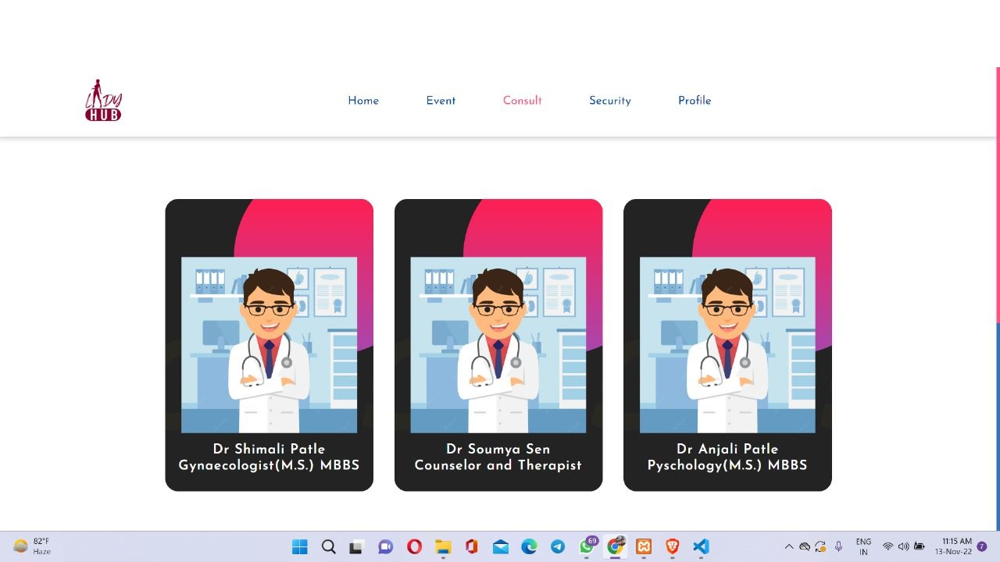

# LadyHub

A website aimed at spreading awareness and providing solution to issues related to mental and physical health and well being among women.

    
  </a>

## Overview

Our idea is to build a website which serves as a complete guide to a women's mental and physical health and well being. We aim at spreading awareness about health which is often neglected among women. Our website plans to constitute various features such as tracking of menstruation cycles, a quick general healthcare check up, mental health wellness and fitness blogs, a recreation or resources page, connect with doctors,Forum where women can discuss and share experiences etc.

## Features

* User Authentication
* General Health Diagnosis
* Mental Health Diagnosis
* Menstrual Cycle Tracker
* Diet Planner
* Calendar Alerts
* Security
* Health and Fitness Events
* Community Forum
* Expert Consultancy
* Video Chat with Experts
* Shop Health, Fitness and Wellness Products

### Web Technology

- Frontend
  - HTML
  - CSS
  - JavaScript
  
- Backend
  - PHP
  - MySQL (Database)

- Tools
  - Xampp
  - Git
  - Github
## Setup

- Download & install [Xampp](https://www.apachefriends.org/download.html)
- Download the Zip or clone the repository
 bash
git clone https://github.com/sainik-khaddar/LadyHUB.git

- Go to the directory where Xampp is installed. For eg. C:\xampp\htdocs
- Copy the project folder and paste it in the address mentioned above.
- Launch any browser window and search localhost/sashakti.
- Voila, explore and enjoy!

## Screenshots

## pequeño video

 I provide a youtube vid. link to explain ,that how it works.Thankyou.

 https://youtu.be/lp4MPAHNkzA

## Our Team
- Sainik Khaddar
- Uttam Kanti Dutta
- Disha Das
- Soham Chaudhuri

### More power to women!
